# qclcnc

qclcnc - quick closed-loop computer numeric controller

qclcnc is cnc software for the raspberry pi that works in the terminal.

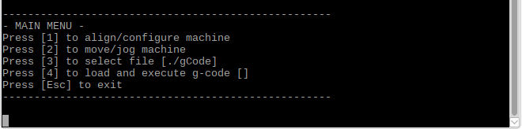

#### Required Hardware
* Rapsberry Pi (tested with a Rapsberry Pi 3 Model B)  

* 3 AMT103-V Encoder Kits  
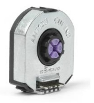

* 3 Dual Shaft Stepper Motors (tested with a Zen Toolworks 7x7 F8 CNC Machine)  
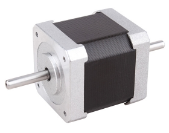

* TB6560 3 Axis Stepper Motor Driver Controller Board  
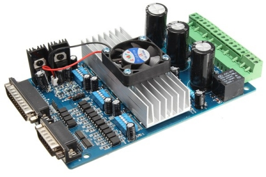

* Breadboard or 2 Mini Breadboards  
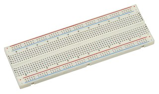

* Female Parallel LPT Printer Port Cable  
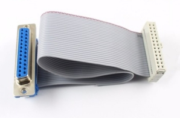

* 3 Internal 5 Pin USB IDC Motherboard Header Cables  
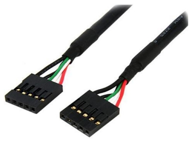

* 9 470ohm and 9 330ohm Resistors  
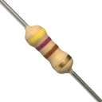 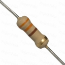

* Female to Male Jumper Wires and Male to Male Jumper Wires (or regular wires)  
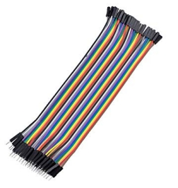 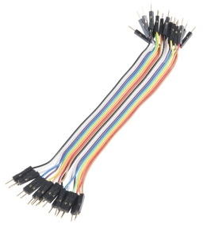

#### Schematic

#### Getting Started
The printer port cable is for the motor driver board.  
The internal 5 pin usb cables are for the encoders.  

It might be easier to try driving a single motor and then reading a single encoder using the example code.  
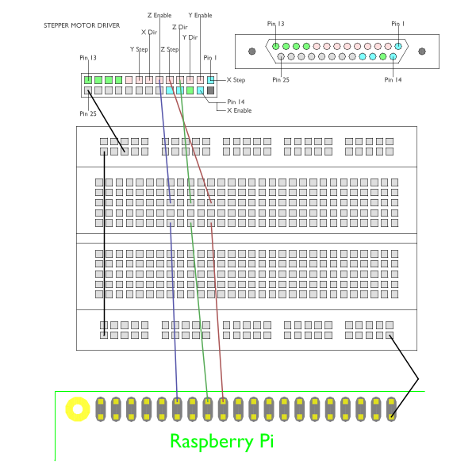
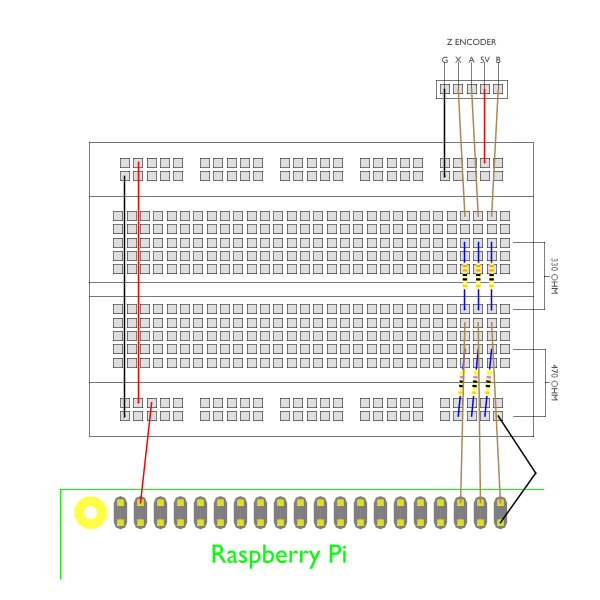

#### Configuring
An example configuration file can be found with the source code.  
The example code in "Read_Encoder_Example" can help you find the number of mechanical degree units the encoder has moved.  
The example code in "Stepper_Ctrl_Example" can help you find the number of input pulses given to a stepper motor driver.  

#### Supported G-code
An example .ngc file can be found with the source code containing the possible g-codes.  

#### The Auto Align Feature Using The Encoder Index Pulse
In the align/configure menu there is a way to get the index offset for each axis and then once you have that you can use "quick index pulse auto alignment" every time you run your machine to get an exact location.  
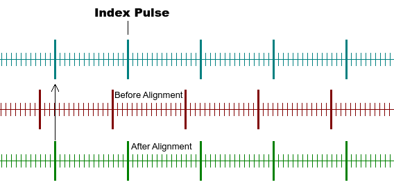

CAD Software:  
[https://github.com/lowlevel86/blender249b-CAD](https://github.com/lowlevel86/blender249b-CAD)

